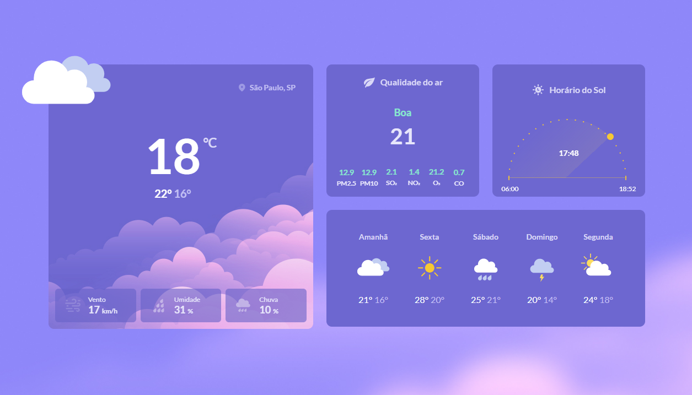

<h1 align="center" >Clima</h1>

<h3 align="center" >Página estática de clima, com várias informações<h3>
 
  
  <h2 align="center" >Demonstração</h2>

  <a href="https://dev-joaovictor.github.io/clima/" ></img></a>

## Deploy

**Link para testes:** <a target="_blank" href="https://dev-joaovictor.github.io/clima/">https://dev-joaovictor.github.io/clima/</a>

## Stack utilizada

**Front-end:** HTML e CSS

## Aprendizado
Com essa aplicação Web, reforcei os conceitos básico e os fundamentos das linguagens

